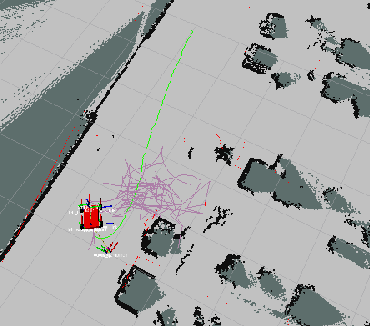

## Errors
- `[WARN] Map update loop missed its desired rate`  
  map cannot be updated as fast as given parameters  
  try:   
    - use a smaller or lower resolution map   
    - provide more computational power.


## Issues
- keep producing oscillations around global path when encountering moving obstacles   

  **solutions**

  
  - in `turn_on_wheeltec_robot/costmap_common_params/param_senior_akm/teb_local_planner_params.yaml`:  
    - increasing `max_vel_theta` and `acc_lim_theta` 
    `max_vel_thema`最大转向角速度
    - decreasing `inflation_dist` and `min_obstacle_dist`
  -  `TebLocalPlannerROS::transformGlobalPlan`  
    ```C++
      if (new_sq_dist > sq_dist_threshold)
          break;  // force stop if we have reached the costmap border
    ```
    - decreasing global_plan_prune_distance
## References
[1] https://github.com/rst-tu-dortmund/teb_local_planner/issues/92  
[2] https://github.com/rst-tu-dortmund/teb_local_planner/issues/338