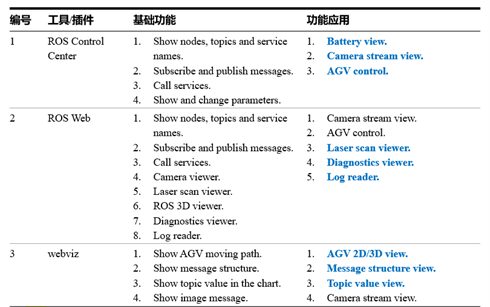

​		经过前期调研，满足在线实时显示点云数据的插件有以下几种。ROS control center功能相对单一，并且每个功能由一个插件构成，使用起来较为繁琐，并且不利于后期扩展。ROS web版本比较老旧，并且网络上可供参考的案例相对较少。因此我们最终选择了webviz作为本项目的工具进行开发。

​		Webviz是一款Cruise公司开发的数据可视化Web应用程序，它允许用户配置不同的面板布局。每个面板都是一个数据探索工具，显示文本日志、2D图表和AV s环境的3D描述等信息。它们对应于现有的开源工具，如rviz, rqt console, rqt_runtime_monitor, rostopic echo, and rqt_plot。

​		本项目中，我们已经实现了在前端展示静态建图并叠加实时点云数据，并且可以实时传输RGB摄像头和深度摄像头的图像。

​		后续可以尝试将AGV导航控制集成到前端（网络有类似[案例](https://www.bilibili.com/video/BV1N64y1S7AW/?spm_id_from=..top_right_bar_window_custom_collection.content.click)，但没有具体实现方法），减少后端控制
